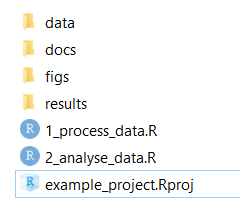
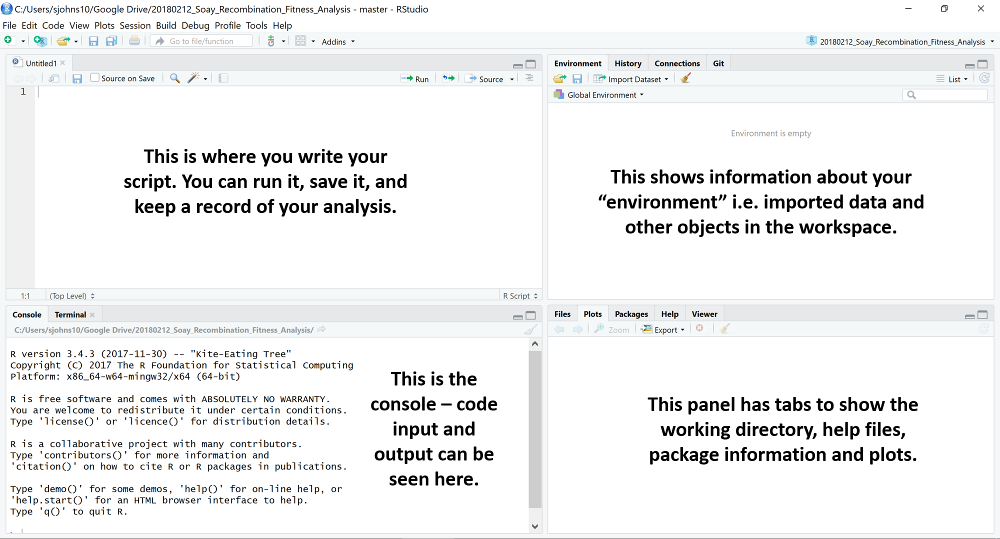

```{r setup, include=FALSE}
library(learnr)
```

## Introduction

This tutorial is based on information from [Our Coding Club](https://ourcodingclub.github.io/) and [R4all](http://r4all.org/). The datasets for this tutorial can be downloaded from [https://github.com/susjoh/Intro_to_R](https://github.com/susjoh/Intro_to_R)

### What is **R**?

**R** began its life in New Zealand in 1993 as a language and environment for statistical computing and graphics. It is an interpreted programming language, meaning that rather than pointing and clicking, the user types in commands. It is **free** and works across all platforms.


### Why use **R**?


> "This is R. There is no if. Only how."  
> -- Simon 'Yoda' Blomberg, R-help (April 2005)

Almost anything is possible in **R**. It is fast becoming the *lingua franca* of academic research, statistics and data science. It is used for:


* Processing and tidying data 
* Statistical analyses
* Data visualistion (`ggplot`)
* Creating interactive web applications (`shiny`)
* Generating reports and presentations (`knitr`, `slidify`)
* Creating portable projects (**RStudio** Projects)


The analytical power of **R** lies in its many packages (16,454 as of 1st Nov 2020). Hundreds of these are written for geoscience, ecology and evolutionary biology. A list of packages are hosted on the Comprehensive R Archive Network (known as **CRAN**): [https://cran.r-project.org/](https://cran.r-project.org/)

## Getting Started: **R** and **RStudio**.

### Installing **R** and **RStudio**

**R** can be downloaded from the CRAN website. Whilst the CRAN download version provides a simple user interface, we recommend that **R** is run through the software **RStudio** This is open-source, free, and available [here](http://www.rstudio.com/).

### Creating an **R** Project.

Using **R** Projects (`.RProj`) allows easier file imports, improved reproducibility and collaboration. This is because it tells **R** where to look for data files and scripts, meaning that a script can be run different machines and environments without any problems. Projects can be created using `File > New Project` and following the instructions.

We have provided the project `Intro_to_R.RProj`. Opening this file will open **RStudio**. If you would rather not use projects, you can set the working directory by using the command `setwd()` or by selecting `Session > Set working directory > Choose directory`

On the Files tab in the **lower right**, you will see the files in the current working directory. This will be useful later when we tell **R** to load files. You can check the working directory by typing `getwd()`.


### Structuring an **R** Project.

Using a good project layout keeps the data reliable, portable and reproducible. This makes it easier for you or a collaborator to pick up the project after a break. There is no single way to structure a project, but an suggestion is shown in Figure 1. This is based on a blog post on Nice R Code available [here](https://nicercode.github.io/blog/2013-04-05-projects/).




_**Figure 1: Example structure for a portable R project.**_


* `data` contains all data used in the analysis and should be treated as **read only** - these files should never be edited or overwritten. Rather, they should be processed within R scripts.
* `docs` contains the paper and/or reports associated with the analysis (in Word, R Markdown, LaTeX, etc).
* `figs` contains any figures generated by R scripts.
* `results` contains any simulation outputs, processed data etc. NB. Data in `figs` and `results` can be treated as disposable.
* `[filename].R` are R scripts. You can split your workflow into units that are logical for you, such as (a) load, merge and clean data, (b) analyse the data and (c) create outputs such as results tables and figures. Some researchers use a numbering method so that the order in which to run different scripts is clear. 
* `example_project.Rproj` is the portable R project.


** The take-home message is to start your analysis from copies of the raw data, doing any cleaning, transforming, merging and so on in scripts. Always comment and document your code thoroughly, explain what it is doing and why.**

### Using **RStudio**

Open `Intro_to_R.RProj` and open the example **R** Script (`1_Example_Script`). **RStudio** should look like Figure 2. 

{width=100%}


_**Figure 2. The RStudio Environment. Adapted from OurCodingClub.github.io**_

On the **lower left** is the **Console** pane - this is the engine of **R**. You can give instructions to **R** by directly typing at the prompt (`>`).

On the **upper left** is your **R** Script - here, you can write commands and send them to the console by clicking `Run` or by typing `Ctrl-Enter`. `#` is the comment character in **R**. 
  
On the **lower right**, you can browse the packages installed on your machine, open files and search **R** Help. This pane will also show plots when we run them later in the practical.


### **Exercise 1**

Try running some basic commands directly in the console and from the **R** Script:

```{r Basic_commands_A, eval = F}
2+3
1:10
seq(from = 1, to = 20, by = 4)
mean(c(3, 6, 9, 3, 6, 7))
```

Let's assign a sequence of numbers to an object, `x`:

```{r Basic_commands_B, eval = F}
x <- 1:10
x
y <- seq(from = 0, to = 4.5, by = 0.5)
y
```

You can see that in the upper right pane, we can see this new objects `x` and `y` in the environment.

<details><summary><font color="blue">**Click here for advanced exercises**</font></summary>

Read the next short paragraph on finding help within R. Use this information to generate two vectors of length 100.

`x` is normally distributed with a mean of 0 and a standard deviation of 1.

`y` is uniformly distributed with a range between 0 & 1.

</details>


---

### Finding Help within **R**.

The fastest way to find help in **R** is to search using `?`. For example:

```{r eval = F}
`?mean`
```

should bring up a help page for the function `mean()` in the lower right corner. Typing two question marks will search all help files and return a list of those that match.

```{r eval = F}
??mean
??"standard error"
```

### **Exercise 2.**

1. Using only `?` and/or `??`, find a function for calculating the standard deviation. What is the standard deviation of `x`?

2. Using `?`, find the help file for the `sort()` function. Sort `x` and `y` in reverse order.

### Troubleshooting and finding help outside of **R**.

* [Coding Club Tutorials \& Useful Links](https://ourcodingclub.github.io/)
* [Stack Overflow](https://stackoverflow.com/): Try searching with the tag [R]
* [**RStudio** Cheatsheets](https://www.rstudio.com/resources/cheatsheets/)


## Loading data into **R**.

Now that we are familiar with the **RStudio** environment, it's time to start working with real data. In the folder `data`, you have been provided with a single dataset on Peruvian Soil in two common formats - `.txt` (tab-delimited) and `.csv` (comma-delimited).
    
Using **R** Projects means that the working directory is the same as the .Rproj file. We will use `read.csv()` to read in the data-set. Try typing the following into your script, and guiding the command to the data file using the `Tab` key:
      
```{r eval = F}
Peru_Soil_Data <- read.csv("
```

You should now have the following code in your script:

```{r}
Peru_Soil_Data <- read.csv("data/Peru_Soil_Data.csv")
```


You can also use either `read.table()` which offers more flexibility on defining various features about the input files.

### Exercise 3.

* Using `?`, find the help page for `read.table`. Read the file `Peru_Soil_Data.txt` into **R**. Check the loaded object using the `head()` function. Do you need additional arguments to read in the file properly?

The object `Peru_Soil_Data` is a type of object known as a **data frame**. You can explore the data visually by clicking on its entry in the Environment tab. Alternatively, there are functions in base **R** for exploring data e.g. `head()` and `str()`. Try these out.

<details><summary><font color="blue">**Click here for advanced exercises**</font></summary>

Read in `Peru_Soil_Data_Problematic.txt` with `read.table()`. If it doesn’t work, check the help file. If it does work, has all the data read in properly?

Explore `read_delim()` in the `readr` package – does this offer more flexibility? Print the table – do you like this format? (If so, feel free to use it 😊)

</details>


## Data management in **R**.

Exploring and manipulating data is fundamental to data analysis. In this section, we will briefly cover how to sort and filter the soil dataset. There are several approaches to doing this in the base code of **R**, but here we will use on the functions `select()`, `filter()` and `arrange()` from the package `dplyr`. 

First, we need to load the `dplyr` package. It is good practice to do this at the beginning of the script when you are setting up the working environment.

```{r message=F}
library(dplyr)
```

NB. Some of you may get an error message: <font color="red">`Error in library(dplyr) : there is no package called 'dplyr'`</font>

In this case, the library has to be installed from CRAN. This can be done by typing `install.packages("dplyr")`. It may ask you to select a mirror - select the RStudio Global mirror, or one that which is geographically closest to you. 
### Summary Statistics.

Functions such as `head()` and `str()` are useful to telling you what your data look like, but don't give much information on what the data say.

A versatile function for exploring objects is `summary()`. This function summarises each numeric column in terms of the median, mean, inter-quartile range, minimum and maximum. It also provides information on levels and sample sizes for categorical variables.

```{r eval = F}
summary(Peru_Soil_Data)
```

### Sorting data with `arrange()`

There are occasions where it is useful to have sorted data, either because we would like to examine it, or for some types of statistical analyses i.e. with time-series data. The `arrange()` function sorts data frames as so:

```{r eval = F}
# sort by Soil pH value:
arrange(Peru_Soil_Data, Soil_pH) 
# sort by decreasing Soil pH value:
arrange(Peru_Soil_Data, -Soil_pH) 
# sort by habitat and then soil pH within habitat:
arrange(Peru_Soil_Data, Habitat, Soil_pH) 
```

### Sub-setting columns with `select()`

At its simplest, columns can be selected using their numeric references in square brackets (**after** the comma):

```{r eval = F}
Peru_Soil_Data[,1]
Peru_Soil_Data[,3:5]
Peru_Soil_Data[,c(1, 4, 5)]
```

It is not always recommended to use numerical references, as addition or removal of columns can change the numbers, leading to mistakes. The best solution is to use the column names themselves. A convenient way to do this is to use the `dplyr` `select()` function, which will select or remove columns of the data. Try running:

```{r, eval = F}
select(Peru_Soil_Data, River_Basin)
select(Peru_Soil_Data, -River_Basin)
```

More than one column can be selected or removed by adding more column names:

```{r, eval = F}
select(Peru_Soil_Data, River_Basin, Magnesium, Sodium)
select(Peru_Soil_Data, -River_Basin, -Magnesium, -Sodium)
```

### Adding columns.

New columns can be added to the data containing information or calculations that you are interested in. We can do this in standard base **R** using the code `$`, which can be used to call existing variables from a data frame. For example, river basin can be called as so:

```{r, eval = F}
Peru_Soil_Data$River_Basin
```

Columns can be added by creating new variables within the data frame. Here, we can create a new column called `log_Calcium` which takes the `log_{10}` of the Calcium column:

```{r, eval = F}
Peru_Soil_Data$log_Calcium <- log10(Peru_Soil_Data$Calcium)
head(select(Peru_Soil_Data, Site, Calcium, log_Calcium))
```

### Sub-setting rows with `filter()`

Sub-setting data by rows is one of the most common tasks carried out in data manipulation steps. Again, at it's simplest, rows can be selected using their numeric references in square brackets (**before** the comma):

```{r, eval = F}
Peru_Soil_Data[1,]
Peru_Soil_Data[1:5,]
```

However, this is clearly not useful if we wish to select rows based on a particular criteria. For this, we can used the `filter()` function, specifying an argument with the following logical operators:

Operator | Function
-------- | --------
`<` | less than 
`>` | greater than
`=<` | less than or equal to
`=>` | greater than or equal to
`==` | equals 
`!=` | does not equal 
`%in%` | matches 

For example, in the soil data, we may wish to select only rows for the floodplain habitat and the Los Amigos River Basin:

```{r echo = F, eval = F}
filter(Peru_Soil_Data, Habitat == "floodplain", River_Basin == "Manu")
```

### **Exercise 4.**

1. Create a new data frame, `Peru_Upland_Soil`, which includes row only from upland habitats.
2. Edit this data frame so that it only includes data from the Manu and Los Amigos river basins (Hint: use `%in%`)
3. Edit this data frame again so that it is sorted by increasing Calcium levels.
4. Create a new column called `Sum_Ca_Mg` that is the sum of the calcium and magnesium columns.


<details><summary><font color="blue">**Click here for advanced exercises**</font></summary>

5. Explore the `group_by()` and `summarise()` function in `dplyr` using `?` or a search engine. Use these functions to create a data frame with the mean Phosphorus and Calcium measures for each habitat.

6. There was a problem with the device measuring the Calcium concentrations in Los Amigos. Can you multiply *only* these data points by two?

</details>


## Data visualisation with `ggplot2`

One of **R**'s most powerful tools is its ability to produce publication quality graphics in an automated and reproducible way. Base **R** contains graphical tools for simple, exploratory graphics. These are easily called with functions such as `hist()` and `plot()`:

```{r eval=F}
# histogram
hist(Peru_Soil_Data$Calcium)

# plot
plot(Magnesium ~ Calcium, data = Peru_Soil_Data, col = "red")

# boxplot
boxplot(Magnesium ~ River_Basin, data = Peru_Soil_Data)
```

It is feasible to do anything you require in base graphics, but common actions are not straightforward, including legends, faceting, error bars and customisations of the plot area. Base graphics for quick data exploration, but for everything else we recommend the graphics library `ggplot2`.

### `ggplot2` - the grammar of graphics.

`ggplot2` is a plotting system in **R** which aims to take the best parts of base graphics and allow for easy plot customisation. It has extensive documentation and examples [here](https://docs.ggplot2.org/current/)

`ggplot2` uses **three** components to construct a graph:

1. **Layers:** `ggplot()` Data with aesthetic properties (`aes()`).
2. **Geoms:** `geom_...()` The type of plot (line, scatter, box-plot, etc.)
3. **Stats:** `stat_...()` Statistical transformations (smoothing lines, etc) - NB. every geom has a default statistic, so this component is not always specified.


**All** `ggplot2` graphs begin with the `ggplot()` function, specifying the default data and aesthetic properties. This is just a fancy way of saying that we specify the data frame, and then the x and y variables we want to plot.

### `ggplot2` basics - a scatter-plot.

We can start with a simple scatter-plot of Calcium and Magnesium in the Peru soil dataset. We start by defining the `layer`.


```{r echo = F}
library(ggplot2)
```

```{r eval = F}
library(ggplot2)
ggplot(Peru_Soil_Data, aes(x = Calcium, y = Magnesium))
```

You can see by running the layer alone, we have already run into a problem - there is no data plotted on the graph. This is because we need to specify the `geom` i.e. the type of plot. Let's use a scatter-plot (`geom_point()`):

```{r eval = F}
ggplot(Peru_Soil_Data, aes(x = Calcium, y = Magnesium)) +
  geom_point()
```

If you wanted to add a regression line, we can specify this with a **Stat**. In this case, we can use `stat_smooth(method = "lm")` to add a linear regression line:

```{r eval = F}
ggplot(Peru_Soil_Data, aes(x = Calcium, y = Magnesium)) +
  geom_point() +
  stat_smooth(method = "lm")
```

Adding customisations to the plot is straightforward. For example, colouring the points by habitat is done by adding `col = Habitat` to the `aes()` properties:

```{r eval = F}
ggplot(Peru_Soil_Data, aes(x = Calcium, y = Magnesium, col = Habitat)) +
  geom_point() +
  stat_smooth(method = "lm")
```
As you can see, this automatically adds a legend to the plot for the different habitat types.

### Customising plots.

`ggplot2` has huge capabilities for plot customisations. The sheer amount of things you can do to the graph can be overwhelming (see the help pages), but most commonly, we will want to change labels, scales, colour palettes and facets. Here are a variety of customisations you can play with, and an example graph is given below.

		
Function | What it does
-------- | -------------
`labs()` | Customise the labels associated with `aes()` e.g. `labs(x = "Ca", y = "Mg", col = "Habitat Type")`
`scale_x_continuous()` | Change the scale of the axes 
`scale_y_continuous()` | e.g. `scale_x_continuous(breaks = seq(from = 0, to = 2500, by = 250))`
`facet_wrap()` | Facet the plot by a discrete variable e.g. `facet_wrap(~Habitat)`
`scale_colour_manual` | Example of one of many ways to define colours e.g. `scale_colour_manual(values = c("red", "blue"))`
`theme()` | Formatting options for axes, plot area, etc. e.g. `theme(legend.position = "top")` (see documentation for **many, many** options)
`Default themes` | `theme_bw(), theme_light(), theme_dark(), theme_minimal()` etc. 

```{r eval = F}
ggplot(Peru_Soil_Data, aes(x = Calcium, y = Magnesium, col = Habitat)) +
   geom_point() +
   stat_smooth(method = "lm") +
   labs(x = "Ca", y = "Mg", col = "Habitat Type") +
   scale_y_continuous(breaks = seq(from = 0, to = 2500, by = 250)) +
   facet_wrap(~Habitat) +
   scale_colour_manual(values = c("red", "blue")) +
   theme(legend.position = "top")
```

If you have questions when it comes to customisation, consult the ggplot2 documentation for the types of graph you wish to make, or search Stack Overflow with the tags [r] and [ggplot2].

### Saving plots

Plots can be saved to file using `ggsave()`. It defaults to saving the last plot that you displayed, using the current size of the graphics window. The type of graphic that is saved depends on the extension you define (e.g. .png, .pdf, etc.). At it's simplest, it can be run as so:

```{r eval = F}
ggsave("figs/Habitat_Ca_Mg.png")
```

Other specifications can be made, such as plot height, width, resolution and so on:

```{r eval = F}
ggsave("figs/Habitat_Ca_Mg.png", width = 12, height = 8, units = "cm", dpi = 300)
```

### **Exercise 5.**

1. Create a scatter-plot of Calcium against Potassium. Colour the points based on the Soil pH.

2. Using the ggplot2 help pages, make a box-plot of River Basin (x-axis) and Soil pH (y-axis). Facet the plot by habitat.

3. Using the ggplot2 help pages, make a bar-plot of Site (x-axis) and Sodium (y-axis). (NB - Getting an error? Read the help pages carefully!)

4. Colour the bars in the previous plot by River Basin (Hint: swap `col` for another command)

<details><summary><font color="blue">**Click here for advanced exercises**</font></summary>

5. For the Magnesium-Calcium plot, can you orientate the x axis labels to 90 degrees using `theme()`?

6. Can you rescale the y axis to run from 0 to 200?

7.  the Magnesium-Calcium plot facetted by Habitat, can you change the axis so that the scales are not fixed on each facet (i.e. the scales are different and not the maxima of the entire plot area)? Hint - look at the specifications in `facet_wrap()`.

</details>


